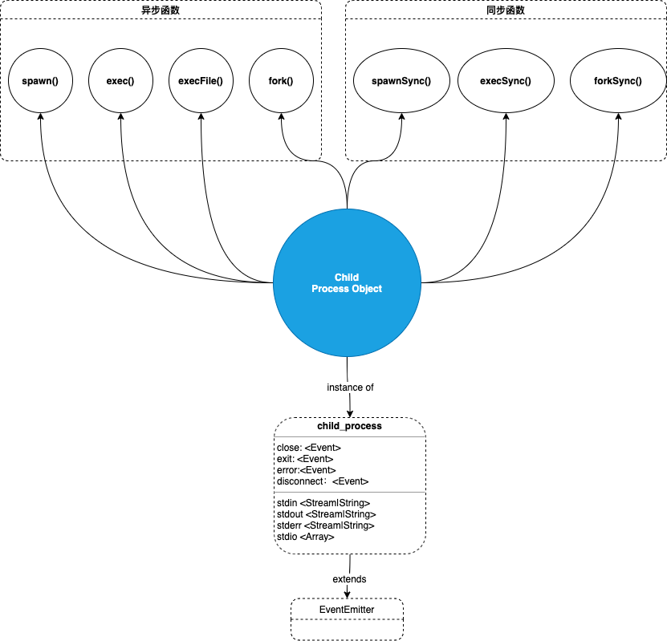

# 你应该了解的Node child_process

## 多线程与单线程

C#，Java都是具有多线程的语言，多线程同步模式是将CPU分成几个线程，每个线程同步运行。


Node 采用单线程、异步非阻塞模式，也就是每一个计算独占CPU，遇到I/O请求，后面的计算不阻塞，异步执行，当I/O完成后，通过事件继续执行 计算2，这样非常适合单个进程


但是一个CPU一个进程不足以处理 庞大的I/O (例如从网络读取、访问数据库或文件系统) 。无论你的服务器多么强大，一个线程仅仅能够支持有限的处理能力。

实际上，Node运行模式虽然是单线程，但是同样可以利用多个进程，当然也能使用集群。

拓展Node应用程序最好的方式是利用多个进程，Node设计的初衷也是利用多个节点构建分布式应用程序。

## child_process 子进程

利用Node提供的`child_process`模块，可以很容易的衍生出一个子进程，而且子进程之间可以通过事件消息系统进行互相通信。

在任何子进程中，我们能做的有很多。比如：

- 可以通过执行系统命令去访问控制操作系统

- 可以控制子进程的输入流，监听子进程的输出流。

- 可以控制传给底层操作系统命令的参数

- 可以命令的输出做任何我们想做的事情。比如，将一个命令的输出作为输入传递给另一个命令（就像我们在 Linux 中所做的那样），因为这么命令的输入和输出都可以使用Node流。

  

  Node的`child_process`模块提供四种异步函数和三种同步函数的方式创建子进程：



我们将看一下四个异步函数如何使用以及他们之间的区别

### spawn()

格式：child_process.spawn(command,[args],[options])

- command  <string>  要运行的命令
- args <string[]> 字符串参数列表
- options <object>
  - shell <boolean>|<string>  如果是 `true`，则在 shell 内运行 `command`
  - stdio <Array>|<string>  子进程的标准输入输出配置
  - cwd <string> 子进程的当前工作目录
  - env <object> 环境变量键值对，默认值：process.env

`spawn` 函数在新的进程中启动一个命令，我们可以通过新的进程向命令传递任何参数。例如，衍生出一个新的进程执行`pwd`命令

```javascript
const {spawn} = require('child_process')
const child=spawn('pwd')
```

我们从`child_process`中解构出`spawn`函数，然后将系统命令`pwd`传递给`spawn`函数，然后执行。

`spawn`函数返回一个`ChildProcess` 的实例，该实例继承了`EventEmitter`，那么我们可以在子进程实例上添加事件的回调函数。例如：我们注册一个监听子进程`exit`的回调函数。

```javascript
const { spawn } = require('child_process')
const child = spawn('pwd')

//code <number>  :如果子进程自己退出，则为退出码
//signal <string> 终止子进程的信号
child.on("exit", (code, signal) => {
  console.log(
    "子进程退出：" + `code ${code} and signal ${signal}`
  )
})
//结果：子进程退出：code 0 and signal null
```

上面例子中，回调函数接收两个参数，`code`和`signal`。当子进程正常结束时，返回的code值为0，`signal`为null。

`ChildProcess`类继承`EventEmitters` 所以实例包括以下几种事件

#### exit

该事件在子进程结束后触发。 如果进程退出，则 `code` 为进程最终退出码，否则为 `null`。 如果进程因收到信号而终止，则 `signal` 是信号的字符串名称，否则为 `null`。 两者之一将始终是非 `null。

> 当 `'exit'` 事件被触发时，子进程标准输入输出流可能仍处于打开状态

#### disconnect

调用父进程中的 [`subprocess.disconnect()`](http://nodejs.cn/api/child_process.html#child_process_subprocess_disconnect) 方法或子进程中的 [`process.disconnect()`](http://nodejs.cn/api/process.html#process_process_disconnect) 方法后会触发 `'disconnect'` 事件。 断开连接后就不能再发送或接收消息，且 [`subprocess.connected`](http://nodejs.cn/api/child_process.html#child_process_subprocess_connected) 属性为 `false`。

#### error

在无法衍生该进程，或进程无法终止，或向子进程发送消息失败，该事件就会被触发。发生错误后，`'exit'` 事件可能会也可能不会触发。 

>  在监听 `'exit'` 和 `'error'` 事件时，防止多次意外调用回调函数

#### close

该事件在进程结束_并且_子进程的标准输入输出流已关闭后触发。 这与 [`'exit'`](http://nodejs.cn/api/child_process.html#child_process_event_exit) 事件不同，因为多个进程可能共享相同的标准输入输出流。 `'close'` 事件将始终在 [`'exit'`](http://nodejs.cn/api/child_process.html#child_process_event_exit) 或 [`'error'`](http://nodejs.cn/api/child_process.html#child_process_event_error)（如果子进程未能衍生）已经触发后触发。

- `code` 如果子进程自己退出，则为退出码。
- `signal`终止子进程的信号。

```javascript
const { spawn } = require('child_process');
const ls = spawn('ls', ['-lh', '/usr']);

ls.stdout.on('data', (data) => {
  console.log(`stdout: ${data}`);
});

ls.on('close', (code,signal) => {
  console.log(`child process close all stdio with code ${code}`);
});

ls.on('exit', (code,signal) => {
  console.log(`child process exited with code ${code}`);
});
```

#### message

该事件是很重要的一个。当子进程使用 [`process.send()`](http://nodejs.cn/api/process.html#process_process_send_message_sendhandle_options_callback) 发送消息时触发 `'message'` 事件。这就是父/子进程可以相互通信的原因。我们将在下面看到一个例子


每个子进程具有标准流`stdio`。所以我们可以使用`child.stdin`,`child.stdout`,`child.stderr`。

当标准流`stdio`关闭时，会触发`close`事件。`close`事件和`exit`事件不同，因为多个子进程共享同一个标准流`stdio`，所以当一个子进程退出，并不代表标准流会关闭，也就是 `exit`事件被触发的时候，`close` 事件不一定被触发。

由于所有流(Stream)都继承了`EventEmitter`，所以，可以在`stdio`附加到每个子进程的流上监听不同的事件。与正常进程不同的是，在子进程中，`stdout`/`stderr`是可读流，而`stdin`流是可写流。这和主进程截然相关。最重要的是，在可读流上，我们可以监听`data`事件，该事件将在命令输出或执行命令时遇到的任何错误的时候，都会触发`data` 事件  

```javascript
const { spawn } = require('child_process')
const child = spawn('pwd')

child.on("exit", (code, signal) => {
  console.log(
    "子进程退出：" + `code ${code} and signal ${signal}`
  )
})

child.stdout.on("data", data => {
  console.log(`child stdout:\n${data}`);
});

child.stderr.on("data", data => {
  console.error(`child stderr:\n${data}`);
});

//  运行结果:
//
//  dchild stdout:
//  /Users/liujianwei/Documents/personal_code/node-demo
//
//  子进程退出：code 0 and signal null
```

上面的例子展示了标准输出和标准错误都可以通过监听`data`事件，处理执行结果。可以看到运行结果，子进程退出时`code`值为0，代表没有异常错误发生。

可以通过`spawn`第二个参数，给命令传递参数，第二个参数是数组类型。例如：利用`find`命令查找当前目录下面的所有文件，需要参数 `-type f`。

```javascript
const child = spawn("find", [".", "-type", "f"]);
```


执行命令的过程中如果发生错误，`child.stderr`的`data`事件会被触发，同时`exit`事件将抛出code值，值为1，代表着发生了异常错误。错误值实际上取决于主机操作系统和错误类型。

子进程`stdin`是一个可写的流。我们可以通过他给命令行传入一些东西。就像任何可写流一样，消费可写流最简单的方式是通过`pipe`函数，可以简单的将可读流传入到可写流。主进程的`stdin`是一个可读流，子进程的`stdin`是一个可写流，可以通过`pipe`将他们连接。例如：

```javascript
const { spawn } = require("child_process");

const child = spawn("wc");

process.stdin.pipe(child.stdin);

child.stdout.on("data", data => {
  console.log(`child stdout:\n${data}`);
});
```

上面的例子中，子进程运行`wc`命令，等待输入。然后通过`pipe`函数，主进程将`sdtin`传入到子进程的`stdin`。通过这种组合，得到了一个标准输入模式，我们可以在其中输入一些东西，通过 `Ctrl+D`结束输入，我们输入的内容将用作`wc`命令的输入。


我们也可以像Linux一样，通过 `pipe`函数把多个子进程串联起来。例如：

```javascript
const { spawn } = require("child_process");

const find = spawn("find", [".", "-type", "f"]);
const wc = spawn("wc", ["-l"]);

find.stdout.pipe(wc.stdin);

wc.stdout.on("data", data => {
  console.log(`Number of files ${data}`);
});
```


## Shell语法和exec()

`exec`方法将会生成一个子shell，然后在该 shell 中执行命令，并缓冲产生的数据，当子流程完成后，并将子进程的输出以回调函数参数的形式一次性返回。exec方法会从子进程中返回一个完整的buffer。默认情况下，这个buffer的大小应该是200k。如果子进程返回的数据大小超过了200k，程序将会崩溃，同时显示错误信息“Error：maxBuffer exceeded”。你可以通过在exec的可选项中设置一个更大的buffer体积来解决这个问题，但是你不应该这样做，因为exec本来就不是用来返回很多数据的方法

我们把上面的例子用`exec`实现

```javascript
const { exec } = require("child_process");

exec("find . -type f | wc -l", (err, stdout, stderr) => {
  if (err) {
    console.error(`exec error: ${err}`);
    return;
  }

  console.log(`Number of files ${stdout}`);
});
```

因为`exec`方法是通过shell去执行的命令，随意我们可以直接写shell语法，充分shell管道的特性

默认情况下，`spwan`不会创建一个shell去执行命令，但是可以通过第三个参数设置去支持shell去执行命令。上面我们提到，spawn 会返回一个带有stdout和stderr流的对象。可以通过`pipe`很方便的消费数据。

```javascript
const child = spawn("find . -type f | wc -l", {
  stdio: "inherit",
  shell: true
});
```

设置了`stdio:"inherit"`,当我们执行代码时，子进程会继承主进程的`stdin`,`stdout`和`stderr`。这会导致主进程的`process.stdout`会触发子进程的`data`事件，并立即输出结果。

设置了`shell:true`，我们可以想`exec`那样使用shell执行命令。

当你想要子进程返回大量数据给Node时，比如说图像处理，读取二进制数据等等，你最好使用spawn方法。

当你想用shell语法，并且数据非常小，使用`exec`是最好的选择

这里我们在说一下`spwan`另外两个重要的参数`cwd`和`env`。cwd可以设置当前工作目录：

```javascript
const child = spawn("find . -type f | wc -l", {
  stdio: "inherit",
  shell: true,
  cwd: "/Users/liujianwei/Downloads"
});
```

env设置环境变量，默认是`process.env`。如果设置了该参数，那么将获取不到`process.env`上的变量。

```javascript
const { spawn } = require('child_process')
const child = spawn("echo $ANSWER ;\n echo $HOME; ", {
  stdio: "inherit",
  shell: true,
  env: { ANSWER: 42 }
})
```

上面的的例子中，$ANSWER 结果是42，无法获取到$HOME的值

### execFile()

`child_process.execFile()` 函数与 [`child_process.exec()`](http://nodejs.cn/api/child_process.html#child_process_child_process_exec_command_options_callback) 类似，不同之处在于它默认不衍生 shell。 而是，指定的可执行文件 `file` 直接作为新进程衍生，使其比 [`child_process.exec()`](http://nodejs.cn/api/child_process.html#child_process_child_process_exec_command_options_callback) 略有效率。

支持与 [`child_process.exec()`](http://nodejs.cn/api/child_process.html#child_process_child_process_exec_command_options_callback) 相同的选项。 由于未衍生 shell，因此不支持 I/O 重定向和文件通配等行为。

```javascript
const { execFile } = require('child_process');
const child = execFile('node', ['--version'], (error, stdout, stderr) => {
  if (error) {
    throw error;
  }
  console.log(stdout);
});
```

### Fork()

 child_process.fork 是 spawn()的特殊形式，用于在子进程中运行的模块，如 fork(‘./son.js’) 相当于 spawn(‘node’, [‘./son.js’]) 。与spawn方法不同的是，fork会在父进程与子进程之间，建立一个通信管道，用于进程之间的通信。

举个例子：

父文件：`parent.js`

```javascript
const { fork } = require("child_process");

const forked = fork("child.js");

forked.on("message", msg => {
  console.log("Message from child", msg);
});

forked.send({ hello: "world" });
```

子文件：`child.js`

```javascript
process.on("message", msg => {
  console.log("Message from parent:", msg);
});

let counter = 0;

setInterval(() => {
  process.send({ counter: counter++ });
}, 1000);
```

看一下执行效果：


在父文件里面，我们用`fork`执行了`child.js`，同时，我们监听了`message`事件，当子进程通过`process.send`发送消息的时候，父文件中的`message`事件将会被触发。

同样，我们也可以在父进程通过`process.send`给子进程发消息。

我们举个实际项目中可能会用到的例子

```javascript
const http = require("http");

const longComputation = () => {
  let sum = 0;
  for (let i = 0; i < 1e9; i++) {
    sum += i;
  }
  return sum;
};

const server = http.createServer();

server.on("request", (req, res) => {
  if (req.url === "/compute") {
    const sum = longComputation();
    return res.end(Sum is ${sum});
  } else {
    res.end("Ok");
  }
});

server.listen(3000);
```

我们有一个http服务，该服务有两个端点，当我们请求`/compute`端点的时候，执行`longComputation`函数进行大量CUP计算，会阻塞I/O。如果此时我们在访问 另一个端点，是得不到`OK`响应的。

解决方法是将  `longComputation`函数放在一个子进程中执行，通过fork去执行，这样不会不阻塞I/O。代码如下：

创建一个compute.js文件，放入计算

```javascript
const longComputation = () => {
  let sum = 0;
  for (let i = 0; i < 1e9; i++) {
    sum += i;
  }
  return sum;
};

process.on("message", msg => {
  const sum = longComputation();
  process.send(sum);
});
```

改造：

```javascript
const http = require("http");
const { fork } = require("child_process");

const server = http.createServer();

server.on("request", (req, res) => {
  if (req.url === "/compute") {
    const compute = fork("compute.js");
    compute.send("start");
    compute.on("message", sum => {
      res.end(Sum is ${sum});
    });
  } else {
    res.end("Ok");
  }
});

server.listen(3000);
```

上面的代码受 fork 的进程数量限制，但是当我们执行它并通过 http 请求耗时计算端点时，主服务器根本没有被阻塞并且可以接受进一步的请求

Node的`cluster`模块就是基于这种思想。


## 参考资料

[Node.js Child Processes: Everything you need to know](https://www.freecodecamp.org/news/node-js-child-processes-everything-you-need-to-know-e69498fe970a/)

[node真的是单线程吗？](https://www.cnblogs.com/wxmdevelop/p/10234556.html)

[Node.js 子进程（exec、spawn、fork）](https://blog.csdn.net/chy555chy/article/details/52556318)

 

