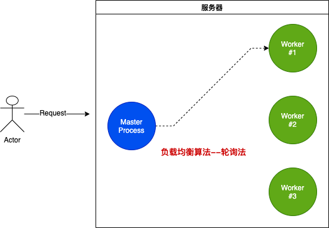

Node.js让应用程序更具有可扩展性。Node的名字体现了Node应用程序应该是由于多个分布在不同节点的node服务组合而成。

**Node主线程是单线程的**，应用程序运行于单个进程中，如果使用`node index.js`方式运行，就启动了一个进程，只能在**一个CPU中进行运算**，无法充分利用服务器的多核CPU。因此，需要**多进程分发策略**，即主进程接收所有请求，然后通过一定的**负载均衡策略**分发到不同的 Node.js 子进程中。

Node的 `cluster` 模块，不仅提供了开箱即用的能力去使用服务器的多核CPU，而且还提供一个**零停机时间重新启动**整个应用程序能力，提高Node进程的可用性。接下来让我们去详细了解一下。

### 可扩展性

提高应用程序的可扩展性，一个原因是要处理大量的并发请求，防止阻塞，另一个原因是为了提高容错能力，保障服务的稳定性。

下面介绍扩展应用程序的三种策略：

#### 1-克隆(Cloning)

扩展应用程序最简单的方法是多次克隆这个应用程序，产生多个实例，并让克隆的每个实例处理部分负载。Node的`cluster` 模块可以容易的实现从单个服务器克隆多个实例。

#### 2-分解(Decomposing)

我们可以根据功能和服务的不同，对应用程序进行拆分，以此达到扩展应用程序的目标。这意味着拥有多个具有不同代码库的应用程序，有时还有它们自己的专用数据库和用户界面，这种策略被称为**微服务(Microservice)**。微服务提供的接口颗粒度都比较低，但实际上，服务的大小并不重要，重要的是服务之间应该高内聚，低耦合。

这种方式实现成本比较高，而且容易产生意想不到的错误，不过想PHP，Java都有成熟的微服务框架，如果做得对，会有很大的优势。

#### 3-拆分( Splitting)

这种方式把应用程序拆分成多个实例，每个实例处理值处理一部分请求数据。这种策略在数据库中通常被称为**水平分区**或**分片**。数据分区要想知道自己该使用哪个应用程序，就需要在每个操作之前执行查找步骤。例如，我们想根据用户的国家或语言对用户进行分类。我们需要先查找用户的一些基本信息，确定用户的国家和语言。

通常，比较大的应用程序会实现以上三种策略。Node也可以实现以上三种策略，但是本文我们将重点放在 克隆策略上，并通过利用Node的内置模块，实现一下   `cluster` 的功能 。

### 集群(cluster)

`cluster` 模块基于`child_process`模块的`fork`方法，多次`fork`**主进程**，产生多个**子进程**，这样就可以使用多核CPU，充分利用了服务器的资源。

这种方式 **主进程**监听一个端口，**子进程**不监听端口，通过**主进程**分发请求到**子进程**，支持**负载均衡**。**PM2进程管理工具**会将这个过程变得更容易执行。

下面我们看一下cluster是如何工作的。




在 cluster 模式中存在 **master** 和 **worker** 的概念，**master 就是主进程，worker 则是子进程**。master会通过`fork`产生多个worker，并管理他们。每一个worker代表着一个应用程序的实例。

master会接收所有的请求，并通过**负载均衡算法**(**round-robin**)分发给子进程。**Linux服务器**默认会开启这个功能，并且可以全局修改以让操作系统本身支持负载均衡。

**负载均衡算法**在轮询的基础上在所有可用进程之间平均分配负载。第一个请求被转发到第一个**worker** 进程，第二个请求转发到列表中的下一个**worker** 进程，依此类推。当到达列表的末尾时，算法又从头开始。

这是最简单和最常用的负载均衡算法之一，但它不是唯一的。有的算法可以设置分配优先级并选择负载最少的服务器或响应时间最快的服务器。

### 负载均衡的HTTP服务

通过 `cluster` 模块实现一个简单的负载均衡的HTTP服务功能。

创建一个简单的Node服务，在响应之前模拟一些 CPU计算任务：


```javascript
//server.js
const http = require("http")
const pid = process.pid

http
  .createServer((req, res) => {
    for (let i = 0; i < 1e7; i++) {
      //模拟CUP计算任务 
      // console.log(`i=${i}`)
    }
    res.end(`Hanlded by process ${pid}`)
  })
  .listen(4000, () => {
    console.log(`Started process ${pid}`)
  })


```

为了验证我们将要创建的负载均衡是否能够正常工作，在 HTTP 响应中输出了该进程的`pid`，用来识别实际处理请求的应用程序实例是哪一个。

在创建一个集群来将这个服务器克隆到多个 worker 之前，让我们做一个简单的基准测试，这个服务器每秒可以处理多少请求。为此，我们可以使用**Apache 基准测试**工具 ( `ab`)。运行上面的简单 server.js 代码后，运行这个 ab 命令

```javascript
ab -c200 -t10 http://localhost:4000/
```

此命令10秒内创建了200个并发请求。

通过在我机器上测试，运行该简单的Node服务基准测试，得到的结果是每秒中可以处理51个请求，后面我们把这个结果作为一个对比结果。当然，不同的机器，不同的服务器，会有一样的结果。这是一个非常简化的性能测试，不是 100% 准确，但它会清楚地显示集群在多核环境中的差异。

下面，我们应用 `cluster` 模式来包装这个服务。新建一个 `cluster.js`文件：

```javascript
const cluster = require("cluster");
const os = require("os");

if (cluster.isMaster) {
  const cpus = os.cpus().length;//cup内核数量

  console.log(`Forking for ${cpus} CPUs`);
  for (let i = 0; i < cpus; i++) {
    cluster.fork();// 使用 cluster.fork 创建子进程
  }
} else {
  require("./server");
}
```

在cluster.js文件中，我们导入了`cluster` 和`os` 两个模块。通过`os` 模块，获取机器的CPU内核数量。

首先判断是否为主进程：

- 如果是则使用 cluster.fork 创建子进程；

- 如果不是则为子进程 require 具体的 server.js。

第一次执行这个文件时，我们将执行主进程，该`isMaster`标志将设置为 true。在这种情况下，可以根据 CPU 内核的情况创建多个子进程。再次运行当前文件,但这次是在**工作模式下**，`isMaster`标志设置为`false`。

> 还有另一个标志 isWorker


运行命令启动服务。

```bash
node cluster.js
```

结果：


先来看一下我电脑的配置：


我的处理器配置是**2.6GHZ，六核**，启动了**fork了12个子进程**。重要的是要了解这些是完全不同的 Node 进程。这里的每个worker进程都有自己的事件循环和内存空间

再打开另外一个命令行窗口，多次运行以下命令：

```javascript
curl http://127.0.0.1:4000/
```

当我们现在多次访问 Web 服务器时，请求将开始将交给不同进程的**worker**处理。由于集群模块在选择下一个工作人员时会执行一些优化，因此**worker**不会完全按顺序轮换，但负载将以某种方式分布在不同的子进程中。

当子进程运行时，会执行server.js，处理实际的请求工作。以上基本展示了如果利用 `cluster`模块处理服务，达到充分利用CUP内核的例子。

我们可以使用`ab`上面相同的命令，对这个集群进行负载测试。与我们使用单个 Node 进程每秒处理 51 个请求相比，我在我的机器上创建的集群能够每秒处理 181 个请求。只需几行代码，这个简单应用程序的性能就提高了两倍

### master和worker之间如何通信

主进程和工作进程之间的通信很简单，因为集群只是使用`child_process.fork`API，这意味着我们在主进程和每个工作进程之间也有可用的通信通道。

基于上面的`server.js/cluster.js`例子。`cluster.workers`可以拿到所有的**worker**。所以 **master**可以循环整个worker列表，然后给**woker**发送广播。例如：

```javascript
Object.values(cluster.workers).forEach(worker => {
  worker.send(`Hello Worker ${worker.id}`);
});
```

woker可以通过监听进程的**message**事件，得到主进程给子进程的消息。

```javascript
process.on("message", msg => {
  console.log(`Message from master: ${msg}`);
});
```

看一下效果


每个worker都能接收到master的消息，但是为什么woker没有按顺序输出呢。

创建返回数据库中用户数量的场景，每次访问，数据都成指数倍增长。这里我们用一个函数模拟：

```javascript
// 模拟访问数据库，返回用户数量
const numberOfUsersInDB = function() {
  this.count = this.count || 5;
  this.count = this.count _ this.count;
  return this.count;
}
```

假设numberOfUsersInDB 每次被调用的时候，都已经建立了数据库连接，我们要做的是使用缓存，避免多个请求**并发**的去从数据库获取数据。

```javascript
//cluster.js
const cluster = require("cluster")
const os = require("os")

if (cluster.isMaster) {
  const cpus = os.cpus().length//cup内核数量

  console.log(`Forking for ${cpus} CPUs`)
  for (let i = 0; i < cpus; i++) {
    cluster.fork()// 使用 cluster.fork 创建子进程
  }

  const updateWorkers = () => {
    const usersCount = numberOfUsersInDB()
    Object.values(cluster.workers).forEach(worker => {
      worker.send({ usersCount })
    })
  }

  updateWorkers()
  setInterval(updateWorkers, 10000)
} else {
  require("./server")
}
```

第一次请求时，执行**updateWorkers**，以后每10秒钟更新一次数据。这样每个worker都会通过 主进程的消息，监听到最新的用户数量，而且仅仅用了一个数据库连接。

看一下子进程的代码：

```javascript
// server.js
const http = require("http");
const pid = process.pid;

let usersCount;

http
  .createServer((req, res) => {
    for (let i = 0; i < 1e7; i++); 
    res.write(`Handled by process ${pid}\n`);
    res.end(`Users: ${usersCount}`);
  })
  .listen(8080, () => {
    console.log(`Started process ${pid}`);
  });

process.on("message", msg => {
  usersCount = msg.usersCount;
});
```

### 提高服务器的稳定性

单个实例运行Node应用程序，当实例崩溃时，该实例必须重启。这会导致这两个操作之间会出现一些停机事件，及时该过程是自动化的，也会有时间差。而且，单个实例的情况下部署新的代码，也需要停机。

所以运行多个实例，可以避免这个问题。

下面模拟服务器的随机停机：

```javascript
// worker 子进程 server.js

setTimeout(() => {
  process.exit(1) 
}, Math.random()*10000);
```


master 进程监听 退出事件，给事件注册一个处理程序，并在任何worker进程退出时创建一个新的woker进程

```javascript
//master 主进程 cluster.js
cluster.on("exit", (worker, code, signal) => {
  if (code !== 0 && !worker.exitedAfterDisconnect) {
    console.log(`Worker ${worker.id} crashed.` + "Starting a new worker...");
    cluster.fork();
  }
});
```

代码中添加了一个处理程序，并判断了worker进程退出时，重新创建一个worker进程。这层判断 排除了主进程手动断开或者杀死的情况。

如果使用了太多的服务器资源，master会根据需要通过`disconnect`方法杀死一些worker进程，这种情况下 `worker.exitedAfterDisconnect`值为true，并不需要重新创建一个worker进程。 

运行以上代码，每个woker都会存在随机崩溃的情况。我们进行`ab`测试，在 200 个并发请求的 10 秒测试间隔内，超过 1800 个请求中只有 17 个失败，大约98%的可用性，结果看似很好，但是这样仍然会有一些请求失败，不是理想的结果，接下来，我们急需要看如何实现零停机热重启。

### 零停机热重启

当部署新的代码，升级应用程序的时候，如何重启所有的worker进程呢？这是一个很有意思的问题。

我们运行了多个worker进程实例，我们可以每次只重启一个worker进程，这样其他worker进程的实例可以正常的提供服务，然后依次重启。

实现这个功能也是很容易的，我们只需要给master进程发送一个命令，用该命令去依次控制重启woker进程。在Linux系统中很容易实现，可以兼容进程消息，比如`SIGUSR2`,当使用`kill` 命令，给该命令传入进程id，就触发**SIGUSR2** 事件

```bash
// 在Node中监听事件
process.on('SIGUSR2', () => { ... });

# 杀死指定pid进程
$ kill -SIGUSR2 PID
```

这样，主进程不会被杀死，所以我们在主进程中可以做些什么。`SIGUSR2`是最合适的信号，因为这将是一个用户命令。

> 很不幸在window系统中实现起来就比较麻烦，大家可以自己去研究一下，这里不做说明。

在我们上面的演示代码中，当master进程接收到 **SIGUSR2**信号，可以去重启woker进程了，而且是每次只重启一个子进程，意味着主进程应该只在完成重新启动当前worker程序后，在去重新启动下一个worker程序。

要开始此任务，我们需要定义一个变量，指向包含所有woker进程的数组：

```javascript
const workers = Object.values(cluster.workers);
```

然后我们创建一个 `restartWorker`函数，参数是将要被重启woker的索引。接下来我们可以用**递归的方式**处理所有的woker进程，代码展示：

```javascript
const restartWorker = workerIndex => {
  const worker = workers[workerIndex];
  if (!worker) return;

  worker.on("exit", () => {
    if (!worker.exitedAfterDisconnect) return;
    console.log(`Exited process ${worker.process.pid}`);

    cluster.fork().on("listening", () => {
      restartWorker(workerIndex + 1);
    });
  });

  worker.disconnect();
};

restartWorker(0);
```

当 执行  worker.disconnect();方法的时候，会触发`exit`事件，事件的处理函数中，在断开之后重新fork了一个实例，并且监听`listening`,  listening代表着当前woker成功启动，然后在回调函数中，继续重启下一个 woker进程实例。

以上代码展示了如何零重启。要测试它，您需要读取要发送到`SIGUSR2`信号的主进程 ID：

```javascript
console.log(`Master PID: ${process.pid}`);
```

运行cluster.js，复制master进程的PID，然后执行`kill - SIGUSR2 PID  `命令。然后运行.然后我们进程`ab`测试，查看启动过程对可用性的影响。结果是，零失败请求。

在生产环境中，我们一般会使用**PM2**进程管理工具，PM2 是**守护进程管理器**，可以帮助管理和保持应用程序在线。PM2 入门非常简单，它是一个简单直观的 CLI 工具，并提供了很多功能来监视Node应用程序的健康状况。

```bash
pm2 start server.js -i max
```

零停机热重启

```bash
pm2 reload all
```

更多配置参数 参考[官方文档](https://pm2.keymetrics.io/)：

[cluster 模式以及 PM2 工具的原理介绍](https://lagou.feishu.cn/docs/doccnyq5KSbMLfuu9y4bJVMKCKb)文章写的非常好，如果想了解PM2更多的原理，建议看一下这篇文章，其中总结出了一套最佳实战配置：

```javascript
module.exports = {
    apps : [{
      name: "nodejs-column", // 启动进程名
      script: "./app.js", // 启动文件
      instances: 2, // 启动进程数
      exec_mode: 'cluster', // 多进程多实例
      env_development: {
        NODE_ENV: "development",
        watch: true, // 开发环境使用 true，其他必须设置为 false
      },
      env_testing: {
        NODE_ENV: "testing",
        watch: false, // 开发环境使用 true，其他必须设置为 false
      },
      env_production: {
        NODE_ENV: "production",
        watch: false, // 开发环境使用 true，其他必须设置为 false
      },
      log_date_format: 'YYYY-MM-DD HH:mm Z',
      error_file: '~/data/err.log', // 错误日志文件，必须设置在项目外的目录，这里为了测试
      out_file: '~/data/info.log', //  流水日志，包括 console.log 日志，必须设置在项目外的目录，这里为了测试
      max_restarts: 10,
    }]
  }
```

在上面的配置中要特别注意 **error_file** 和 **out_file**，这里的日志目录在项目初始化时要创建好，如果不提前创建好会导致线上运行失败，特别是无权限创建目录时。其次如果存在环境差异的配置时，可以放置在不同的环境下，最终可以使用下面三种方式来启动项目，分别对应不同环境。

```bash
pm2 start pm2.config.js --env development
pm2 start pm2.config.js --env testing
pm2 start pm2.config.js --env production
```

### 共享状态和负载均衡粘性分配

万物都有两面性，单个进程运行应用程序共享状态和数据的问题，当我们采用集群模式执行应用程序，我们将会面临多个woker进程如何共享数据的问题。

例如：采用集群的方式，我们不能将数据放到内存当中，因为每个worker进程都独有自己的内存空间。假如我们将数据缓存在一个woker进程中，其他woker进程无法访问到。

假如我们想要在集群模式下缓存数据，我们就需要使用想**Redis**这样的工具。

验证用户。对于集群，身份验证请求通过master进程发送给一个worker进程。该worker进程将开始识别该用户的状态。但是，当同一个用户发出另一个请求时，负载均衡可能会将它们发送给其他没有经过身份验证的工作人员。在一个实例内存中保留对该用户身份验证的会话将不再起作用。

这个问题可以通过多种方式解决。通过将这些会话的信息存储在共享数据库或 Redis 节点中，这样多个woker进程之间可以共享状态。但是，应用此策略需要更改一些代码，这并不是唯一的解决方法。还有另一中侵入性更小的方式—**负载均衡粘性分配**。因为负载均衡工具都支持此方式，实现起来也比较容易。当用户通过woker的身份验证时，我们在负载均衡器处保留这个**关系的记录**，形成一张**映射表**。当接到同一用户请求，在**映射表**中进行查找，找到之前的会话在哪个woker进程中，然后再次分配到该woker进程中。

默认情况下 集群不会开启负载均衡粘性分配，需要配置。

### 最后

如果错误和不当之处欢迎留言指正。同时，希望留下你的赞

### 参考资料

- [Scaling Node.js Applications](https://www.freecodecamp.org/news/scaling-node-js-applications-8492bd8afadc/)
- [cluster 模式以及 PM2 工具的原理介绍](https://lagou.feishu.cn/docs/doccnyq5KSbMLfuu9y4bJVMKCKb)

